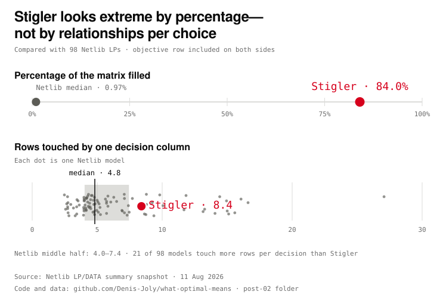
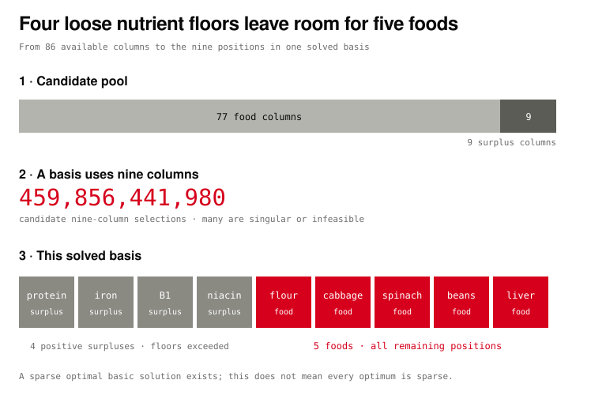

# Rows, Columns, and What They Cost

Reproducibility files for Post 2 of Spatium Novum's **What Optimal Means**
series.

[Read the article on Spatium Novum.](https://spatium-novum.com/posts/rows-columns-and-what-they-cost)

The post asks what matrix dimensions, density, nonzeros and candidate column
sets actually say about the cost of solving a linear program. Stigler's
nutrient table is 82.3 per cent non-zero, but that percentage is inflated by
its very small row count and is not a measure of solve difficulty.

## Run

Python 3.10 or later; no third-party packages are required.

```sh
python3 analyze_structure.py | tee out/structure.txt
python3 verify_klee_minty.py
python3 make_figures.py
```

The first command also writes `out/netlib-summary.csv`. The second checks all
eight vertices—and the seven pivots between them—of the three-variable
Klee–Minty instance using exact rational arithmetic. The third writes:

- two standalone SVG figures for GitHub and sharing;
- seven responsive HTML fragments used in the article; and
- `demo.html`, a local interactive preview.

Open `demo.html` directly in a modern browser after running the commands. The
interaction is dependency-free: the benchmark chart supports mouse, touch and
keyboard selection; the basis and fill-in stories use native radio controls.

## Visual argument

The first figure deliberately lets the reader change the denominator. The same
98 Netlib models can be viewed as percentage density or as rows touched by one
decision column. Stigler moves from 84.0 per cent versus a 0.97 per cent Netlib
median to 8.4 relationships per choice versus a 4.8 median; 21 Netlib models
are more coupled by the latter measure.

The second quantitative figure keeps three ideas separate: 86 available columns, almost
half a trillion candidate nine-column selections, and the nine positive columns
forming the basis at the Post 1 optimum. The available-column bar is
proportional (77 foods to nine surpluses), and the final four-plus-five layout
reflows to a three-by-three grid on narrow screens.





The remaining article fragments explain the four objects in the LP notation,
contrast simplex with interior-point routes, demonstrate fill-in under two
elimination orders, project an exact three-variable Klee–Minty path, and unpack
the hardware/software factors in Koch et al.'s solver-progress study.

## Editorial illustration

`assets/stigler-matrix-machine.jpg` is the opening matrix caricature.
`image-prompt.md` records the exact OpenAI image-generation prompt and explains
the boundary between the conceptual illustration and the data-driven figures.
The illustration is not used as evidence for any numerical claim.

## Data and counting conventions

- `data/stigler_1939.csv` is the same transcription of Stigler's 77-food table
  used in Post 1, distributed with Google OR-Tools.  The nine nutrient rows
  contain 570 nonzeros.  For comparison with Netlib, the analysis adds the
  all-ones objective row, giving a 10 by 77 matrix with 647 nonzeros.
- `data/netlib-lp-readme-2026-08-11.txt` is a dated snapshot of Netlib's public
  [LP/DATA summary](https://www.netlib.org/lp/data/readme). Netlib is an archive
  of numerical software and test data; its LP directory is a long-standing
  benchmark collection used to compare solvers on the same machine-readable
  problems. Netlib says its row and nonzero counts include the objective row,
  while its column and nonzero counts exclude slack and surplus columns. The
  script preserves that convention.

The Netlib table contains 98 entries.  The statistics are descriptive of that
classic benchmark collection.  It is not presented as a representative sample
of current industrial models.

## What the combination counts

Stigler has nine equations after standardisation and 86 columns: 77 foods plus
nine surplus variables.  There are `C(86, 9)` possible selections of nine
columns. These are **candidate column sets**, not necessarily bases and not
distinct feasible vertices. Selections can be singular or infeasible, and
degeneracy lets multiple genuine bases describe the same vertex.

## Sources

- Netlib LP/DATA summary: <https://www.netlib.org/lp/data/readme>
- George B. Dantzig, *Linear Programming and Extensions*, 1963.
- David G. Luenberger and Yinyu Ye, *Linear and Nonlinear Programming*, 3rd ed.,
  §2.3–2.4.
- Timothy A. Davis, Sivasankaran Rajamanickam and Wissam M. Sid-Lakhdar,
  “A survey of direct methods for sparse linear systems,” *Acta Numerica* 25
  (2016), 383–566.
- Victor Klee and George J. Minty, “How Good Is the Simplex Algorithm?”, 1972;
  Benjamin Grimmer's freely adaptable [Johns Hopkins handout](https://www.ams.jhu.edu/~grimmer/Klee.pdf)
  is credited as the visual reference for the independently generated projection.
- Thorsten Koch, Timo Berthold, Jaap Pedersen and Charlie Vanaret,
  [“Progress in Mathematical Programming Solvers from 2001 to 2020”](https://arxiv.org/pdf/2206.09787),
  2022.
