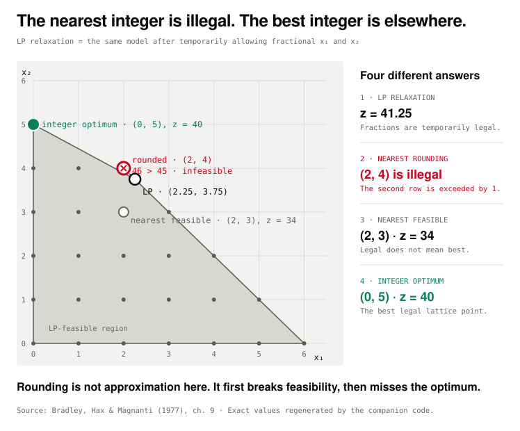
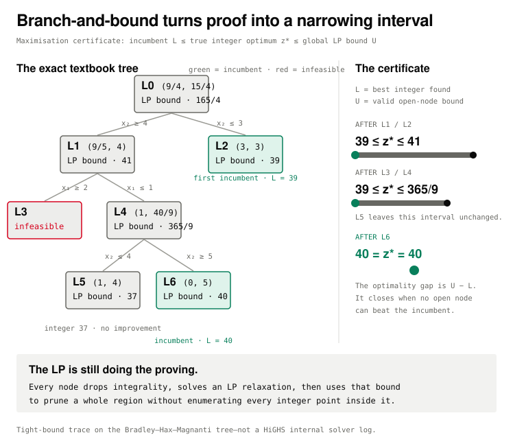

# When the Answer Is Yes or No

Reproducibility files for Post 3 of Spatium Novum's **What Optimal Means**
series. The article asks what survives when a decision must be a whole number,
or literally yes or no, and follows the certificate produced by branch-and-bound.

The package uses the two-variable example in chapter 9 of Bradley, Hax and
Magnanti's *Applied Mathematical Programming*:

```text
maximise  5x1 + 8x2
subject to
          x1 + x2  <= 6
         5x1 + 9x2 <= 45
          x1, x2 >= 0 and integer
```

It is deliberately small enough to verify by exact enumeration. The point is
not that modern solvers search such a tiny tree; it is that every bound and
every pruning decision can be seen and checked.

## Run

From this directory, with Python 3.10 or later:

```sh
python3 solve_example.py
python3 verify_results.py --no-highs
python3 make_figures.py
```

Those commands use only the Python standard library. The optional independent
solver check needs the same open-source packages as the rest of the companion
repository:

```sh
python3 -m pip install -r ../requirements.txt
python3 verify_results.py
```

`verify_results.py` then sends both the continuous relaxation and integer
model through PuLP and HiGHS and compares them with the exact calculation.
No script downloads anything and every generated result is committed.

Open `demo.html` directly, or serve this folder locally, to test the two
interactive figures. The SVG files in `out/` are complete static fallbacks;
the HTML fragments progressively enhance when `visuals.css` and
`article-viz.js` are present.

## What is verified

- The LP relaxation, obtained by temporarily dropping the integer rule, has
  optimum `(9/4, 15/4) = (2.25, 3.75)` and objective `165/4 = 41.25`.
- Nearest-coordinate rounding gives `(2, 4)`. It keeps `x1 + x2 <= 6`, but
  violates the other row: `5(2) + 9(4) = 46 > 45`.
- There are 25 feasible non-negative integer points. The closest one in
  Euclidean distance to the LP optimum is `(2, 3)`, with objective 34. It is
  legal but not optimal.
- The unique integer optimum is `(0, 5)`, with objective 40. The next two
  objective values are 39 at `(3, 3)` and 37 at `(1, 4)`.
- The absolute root integrality gap is `41.25 - 40 = 1.25` objective units.
- The valid integer cut `2x1 + 3x2 <= 15` holds for all 25 feasible integer
  points, while the fractional LP optimum gives `63/4 > 15` and is removed.
- The pedagogical raw-LP-bound trace starts with upper bound
  `U = 165/4`. Solving both root children makes `(3, 3)` the first incumbent
  and gives `39 <= z* <= 41`. Solving `L3` and `L4` lowers the raw LP bound to
  `39 <= z* <= 365/9`; `L5` cannot improve it. Solving `L6` closes the proof
  at `40 = z* = 40`.

## Two gaps that should not be confused

The **root integrality gap** compares the integer optimum with the optimum of a
particular LP relaxation. Here its absolute value is 1.25. It is a retrospective
description of how loose that relaxation was.

The **optimality gap** during branch-and-bound is live. For this maximisation,
the incumbent `L`, the best integer solution found, is a valid lower bound. The
LP relaxations of open nodes supply a valid upper bound `U`, so
`L <= z* <= U`. The interval closes as the search proves that no remaining
branch can beat the incumbent. The trace deliberately retains the raw LP bound
`365/9`. Because every integer-feasible objective value here is integral,
flooring it gives the stronger valid upper bound `U = 40`; the fraction is kept
to show what the LP relaxation itself supplied. Bound directions reverse for
minimisation.

The article uses the absolute interval rather than a percentage gap because
commercial and open-source solvers use slightly different normalisations when
the incumbent is zero, negative or close to zero.

## Files and generated outputs

- `data/bradley-hax-magnanti.json` records the model coefficients and source.
- `example.py` implements exact feasibility, vertex and lattice enumeration,
  plus the independent PuLP/HiGHS cross-check.
- `branch_and_bound.py` uses the textbook branch tree with an explicit
  deterministic schedule, in which both root children are solved first, and
  exact `fractions.Fraction` arithmetic. It is explanatory code, not a solver
  and not a claim about HiGHS's internal search path.
- `solve_example.py` writes `out/results.txt`, `out/results.json`,
  `out/integer-points.csv` and `out/branch-and-bound-trace.json`.
- `verify_results.py` asserts every published number, every node relaxation and
  the monotonic certificate invariants.
- `make_figures.py` writes `out/fig1-rounding-fails.{svg,html}` and
  `out/fig2-branch-and-bound.{svg,html}`, then rebuilds `demo.html`.
- `visuals.css` and `article-viz.js` contain only Post 3-scoped selectors and
  `data-viz` handlers so they can be appended to the site's shared assets
  without overwriting Post 2.

Figure 1 keeps four different objects distinct: the fractional LP optimum,
its infeasible nearest rounding, the nearest feasible integer point in
Euclidean distance and the
integer optimum. Figure 2 follows the exact branch tree while keeping the
maximisation certificate `L <= z* <= U` visible.





## Source and scope

- Stephen P. Bradley, Arnoldo C. Hax and Thomas L. Magnanti,
  [*Applied Mathematical Programming*, chapter 9](https://web.mit.edu/15.053/www/AMP-Chapter-09.pdf),
  Addison-Wesley, 1977. The model and the four-way comparison are in section
  9.4 (Table 9.1); the branching tree and the L0-L6 node labels are in 9.5.
- A. H. Land and A. G. Doig, “An Automatic Method of Solving Discrete
  Programming Problems,” *Econometrica* 28(3), 1960, 497–520.

Only the tiny coefficient table is recorded locally; the source PDF is linked,
not redistributed. Real solver traces depend on solver version, parameters,
hardware, branching, cuts, presolve and heuristics. The exact pedagogical trace
therefore declares its schedule and reports logical search state rather than
invented wall-clock time.
